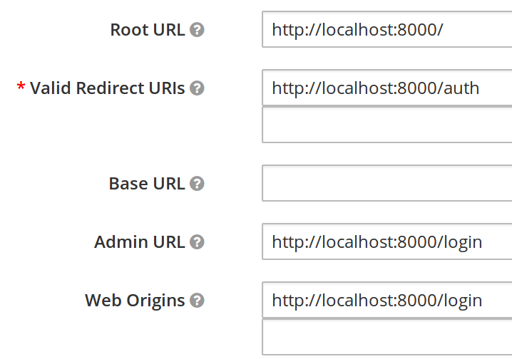

1. Log into keycloak admin console (see docker compose)
2. Create "Clients" realm (upper left)
3. Within "Clients" realm, create a client called "app" with the following URLs

    
4. Create a user with username and password set to "test"
5. `docker-compose down && docker-compose build && docker-compose up`
6. Navigate to `localhost:8000/login`